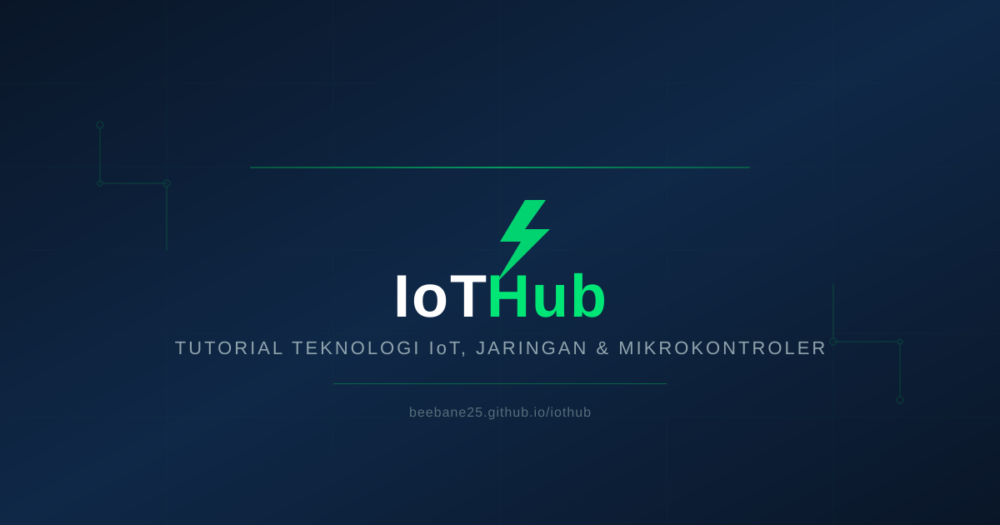

<div align="center">

# ⚡ IoTHub

### Portal Tutorial Teknologi IoT, Jaringan & Mikrokontroler

**Belajar ESP32, MikroTik, LoRa, MQTT, dan IoT dari Nol hingga Mahir**

[](#lisensi)
[]()
[]()
[]()
[]()
[]()
[]()

<br/>



</div>

---

## 🌟 Tentang IoTHub

IoTHub adalah website tutorial teknologi open-source yang dirancang khusus untuk komunitas IoT Indonesia. Dengan **21 tutorial lengkap**, **dark mode premium**, dan **desain visual interaktif**, IoTHub menyediakan pengalaman belajar yang modern dan mudah dipahami.

> 🎯 **Misi:** Membuat teknologi IoT bisa diakses oleh siapa saja, dari pemula hingga engineer profesional.

---

## ✨ Fitur Utama

| Fitur | Deskripsi |
|-------|-----------|
| 🎨 **Dark Mode Premium** | Desain Linear + Supabase inspired, nyaman dibaca |
| 📱 **Responsive Design** | Tampil sempurna di desktop, tablet, dan mobile |
| 🔍 **Search Real-time** | Cari tutorial instan dengan shortcut `/` |
| 📊 **Visual Diagrams** | Architecture diagrams, flowcharts, wiring diagrams dengan CSS |
| 📝 **Quiz Interaktif** | 5 soal per artikel dengan skor otomatis |
| 📧 **Newsletter System** | Subscribe email dengan backend Python |
| 🔒 **Security Hardened** | Rate limiting, XSS protection, CSRF honeypot |
| 🌐 **SEO Optimized** | Meta tags, Open Graph, JSON-LD, sitemap, RSS |
| 📋 **Code Blocks** | Syntax highlight dengan tombol copy satu klik |
| 🎯 **AdSense Ready** | Slot iklan strategis, siap monetisasi |

---

## 📚 Daftar Tutorial (21 Artikel)

<details>
<summary><strong>🔧 Mikrokontroler & IoT (7 artikel)</strong></summary>

| # | Judul | Level | Waktu |
|---|-------|-------|-------|
| 1 | [Panduan Lengkap ESP32](articles/esp32-fundamentals.html) | 🟢 Pemula | 15 min |
| 2 | [ESP8266 NodeMCU untuk Pemula](articles/esp8266-nodemcu.html) | 🟢 Pemula | 10 min |
| 3 | [Sensor DHT11/DHT22 dengan ESP32](articles/sensor-dht-esp32.html) | 🟢 Pemula | 8 min |
| 4 | [ESP32 Deep Sleep: Hemat Baterai](articles/deep-sleep-esp32.html) | 🟢 Pemula | 7 min |
| 5 | [Web Server di ESP32](articles/web-server-esp32.html) | 🟡 Menengah | 11 min |
| 6 | [Telegram Bot untuk IoT](articles/telegram-bot-iot.html) | 🟢 Pemula | 9 min |
| 7 | [Blynk IoT: Aplikasi Mobile](articles/blynk-iot.html) | 🟢 Pemula | 8 min |

</details>

<details>
<summary><strong>🌐 Jaringan & MikroTik (5 artikel)</strong></summary>

| # | Judul | Level | Waktu |
|---|-------|-------|-------|
| 1 | [Konfigurasi Routing MikroTik](articles/mikrotik-routing.html) | 🟡 Menengah | 12 min |
| 2 | [MikroTik Firewall: Filter & NAT](articles/mikrotik-firewall.html) | 🔴 Lanjut | 16 min |
| 3 | [MikroTik Queue: Bandwidth Management](articles/mikrotik-queue.html) | 🟡 Menengah | 14 min |
| 4 | [Keamanan Jaringan IoT](articles/network-security.html) | 🔴 Lanjut | 14 min |
| 5 | [Raspberry Pi untuk IoT](articles/raspberry-pi-iot.html) | 🟡 Menengah | 15 min |

</details>

<details>
<summary><strong>📡 Protokol & Komunikasi (4 artikel)</strong></summary>

| # | Judul | Level | Waktu |
|---|-------|-------|-------|
| 1 | [Protokol MQTT: Panduan Lengkap](articles/mqtt-protocol.html) | 🟡 Menengah | 13 min |
| 2 | [Jaringan Sensor LoRa](articles/lora-communication.html) | 🟡 Menengah | 10 min |
| 3 | [Perbandingan Protokol IoT](articles/iot-protocols-comparison.html) | 🔴 Lanjut | 14 min |
| 4 | [Firebase untuk IoT](articles/firebase-iot.html) | 🟡 Menengah | 12 min |

</details>

<details>
<summary><strong>🛠️ Tools & Dashboard (5 artikel)</strong></summary>

| # | Judul | Level | Waktu |
|---|-------|-------|-------|
| 1 | [Arduino IDE 2.x Setup](articles/arduino-ide-setup.html) | 🟢 Pemula | 6 min |
| 2 | [Otomasi IoT dengan Python](articles/python-iot-automation.html) | 🟢 Pemula | 8 min |
| 3 | [Node-RED untuk IoT](articles/node-red-iot.html) | 🟡 Menengah | 12 min |
| 4 | [Grafana + InfluxDB](articles/grafana-influxdb.html) | 🟡 Menengah | 13 min |
| 5 | [Dashboard Monitoring Real-time](articles/dashboard-monitoring.html) | 🟡 Menengah | 11 min |

</details>

---

## 🛠️ Tech Stack

```
Frontend          Backend           Tools
─────────         ───────           ─────
HTML5             Python 3          Git
CSS3 (Custom)     HTTP Server       GitHub Pages
JavaScript ES6    CSV Database      Google Fonts
Google Fonts      Rate Limiter      Search Console
```

**Desain Terinspirasi:** [Linear](https://linear.app) + [Supabase](https://supabase.com)

---

## 🚀 Quick Start

### Lihat Langsung

Buka `index.html` di browser, atau jalankan server lokal:

```bash
# Clone repository
git clone https://github.com/Beebane25/iothub.git
cd iothub

# Jalankan server lokal
python server.py

# Buka di browser
# http://localhost:8080
```

### Deploy ke GitHub Pages

```bash
# Push ke GitHub (sudah dilakukan)
git push origin main

# Aktifkan GitHub Pages:
# Settings → Pages → Source: main branch → Save
# Website: https://beebane25.github.io/iothub/
```

---

## 📂 Struktur Proyek

```
iothub/
├── index.html                 # Landing page (21 artikel)
├── css/
│   └── style.css             # Dark mode premium theme (972 baris)
├── js/
│   └── app.js                # Search, nav, quiz, subscribe
├── articles/                  # 21 tutorial
│   ├── esp32-fundamentals.html
│   ├── mqtt-protocol.html
│   ├── mikrotik-routing.html
│   └── ... (18 lainnya)
├── images/
│   └── og-default.svg        # Default share image
├── about.html                 # Tentang Kami
├── contact.html               # Hubungi Kami
├── privacy-policy.html        # Kebijakan Privasi
├── terms.html                 # Syarat & Ketentuan
├── disclaimer.html            # Penafian
├── robots.txt                 # SEO crawler rules
├── sitemap.xml                # 27 URLs terindeks
├── rss.xml                    # RSS Feed (21 artikel)
├── server.py                  # Newsletter backend
└── README.md                  # File ini
```

---

## 🔒 Keamanan

Proyek ini telah melalui security audit dan diperkuat dengan:

| Fitur | Status |
|-------|--------|
| XSS Protection | ✅ HTML-encode user input |
| Rate Limiting | ✅ 10 requests/menit per IP |
| Body Size Limit | ✅ Max 1KB per request |
| CORS Restricted | ✅ Specific origins only |
| CSRF Honeypot | ✅ Contact form protected |
| Input Validation | ✅ Regex email validation |
| Error Handling | ✅ No exception details leaked |
| External Links | ✅ rel="noopener noreferrer" |

---

## 📊 Statistik Proyek

| Metric | Value |
|--------|-------|
| 📄 Total HTML Files | 27 |
| 📝 Total Baris Kode | 35.000+ |
| 📚 Total Artikel | 21 |
| 🎯 Quiz Questions | 105 |
| 🔍 Visual Diagrams | 15+ |
| 📱 Responsive Breakpoints | 3 |
| 🔒 Security Fixes | 22 |
| 🌐 SEO Meta Tags | 27 pages |

---

## 🤝 Kontribusi

Kontribusi sangat diterima! Cara berkontribusi:

1. **Fork** repository ini
2. **Buat branch** baru (`git checkout -b feature/nama-fitur`)
3. **Commit** perubahanmu (`git commit -m 'Tambah fitur baru'`)
4. **Push** ke branch (`git push origin feature/nama-fitur`)
5. **Buka Pull Request**

### Ide Kontribusi

- 📝 Tulis tutorial baru tentang IoT
- 🐛 Fix bug atau broken links
- 🎨 Perbaiki desain atau UI/UX
- 🌐 Terjemahkan ke bahasa lain
- 📊 Tambah visual diagram

---

## 📋 Todo

- [ ] Deploy ke GitHub Pages
- [ ] Submit ke Google Search Console
- [ ] Buat gambar OG untuk setiap artikel
- [ ] Tambah tutorial baru (Zigbee, Thread, Matter)
- [ ] Buat YouTube channel untuk video tutorial
- [ ] Implementasi dark/light mode toggle
- [ ] Tambahkan komentar Disqus
- [ ] Analytics dashboard

---

## 📄 Lisensi

Proyek ini menggunakan lisensi **MIT** - lihat file [LICENSE](LICENSE) untuk detail.

```
MIT License

Copyright (c) 2026 IoTHub

Permission is hereby granted, free of charge, to any person obtaining a copy
of this software and associated documentation files (the "Software"), to deal
in the Software without restriction, including without limitation the rights
to use, copy, modify, merge, publish, distribute, sublicense, and/or sell
copies of the Software...
```

---

## 🔗 Link Penting

| Link | URL |
|------|-----|
| 🌐 Website | https://beebane25.github.io/iothub/ |
| 📂 Repository | https://github.com/Beebane25/iothub |
| 📧 Contact | [Hubungi Kami](contact.html) |
| 📋 RSS Feed | [rss.xml](rss.xml) |
| 🗺️ Sitemap | [sitemap.xml](sitemap.xml) |

---

<div align="center">

### ⭐ Star repository ini jika bermanfaat!

Made with ❤️ for Indonesian IoT Community

**[⬆ Kembali ke Atas](#-iothub)**

</div>
